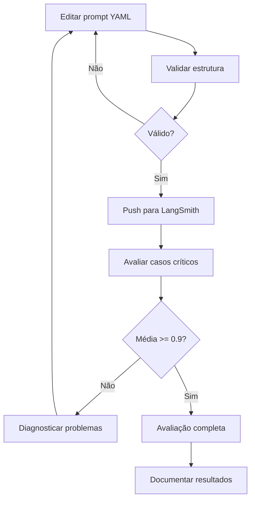
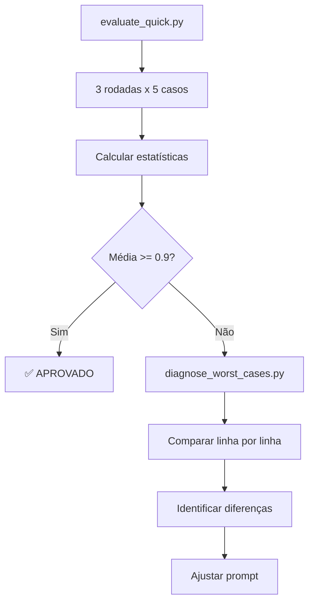

# 📦 Inventário de Arquivos - Projeto Completo

## 📁 Estrutura de Documentação Criada

### 1. Documentos Principais

| Arquivo | Tipo | Finalidade | Público-Alvo |
|---------|------|------------|--------------|
| **README.md** | Guia | Visão geral e quickstart do projeto | Desenvolvedores |
| **RESULTS.md** | Análise | Resultados detalhados e técnicas aplicadas | Avaliadores técnicos |
| **EXECUTIVE_SUMMARY.md** | Sumário | Resumo executivo para apresentação | Stakeholders |
| **TECHNICAL_EVIDENCE.md** | Evidências | Logs e validações técnicas | Auditoria/QA |
| **FILES_INVENTORY.md** | Inventário | Este arquivo - lista todos os arquivos | Referência |

---

### 2. Código Fonte Principal

```
src/
├── evaluate.py          # Script principal de avaliação (10 casos)
├── push_prompts.py      # Push para LangSmith Hub
├── pull_prompts.py      # Pull do Hub
├── metrics.py           # Métricas LLM-as-Judge (5 métricas)
└── utils.py             # Funções auxiliares (load_yaml, get_llm, etc)
```

**Descrição:**
- **evaluate.py:** Avaliação oficial com 10 casos do dataset
- **metrics.py:** Implementação de F1-Score, Clarity, Precision, Helpfulness, Correctness
- **utils.py:** Carregamento de configs, inicialização de LLMs, formatação

---

**Descrição:**

#### evaluate_quick.py (RECOMENDADO)
- **Casos:** 5 casos críticos (#2, #4, #5, #6, #9)
- **Rodadas:** 3 independentes
- **Tempo:** ~3 minutos
- **Saída:** Estatísticas agregadas (média, min, max, desvio)
- **Uso:** `python evaluate_quick.py`

#### diagnose_worst_cases.py (DIAGNÓSTICO)
- **Casos:** 2 piores (#4, #5)
- **Saída:** Comparação linha por linha (output vs referência)
- **Tempo:** ~1 minuto
- **Uso:** `python diagnose_worst_cases.py`

#### diagnose_failures.py (COMPLETO)
- **Casos:** 5 casos problemáticos
- **Saída:** Análise detalhada com métricas e diferenças
- **Tempo:** ~3 minutos
- **Uso:** `python diagnose_failures.py`

---

### 4. Prompts

```
prompts/
└── bug_to_user_story_v2.yml    # ⭐ Prompt v4.0 otimizado (395 linhas)
```

**Estrutura do Prompt:**
- 🎭 Role Prompting (PM Sênior empático)
- ❤️ Emotional Priming (ativação de empatia)
- 🧠 Chain of Thought (6 passos)
- 📊 Rubric-based Prompting (5 dimensões)
- 📚 Few-Shot Learning (7 exemplos)
- ❌✅ Negative Examples (contrastes)
- 📋 Regras Anti-Alucinação (6 regras)

---

### 5. Dataset de Avaliação

```
datasets/
└── bug_to_user_story.jsonl     # 15 exemplos (bug + referência)
```

**Formato:**
```json
{
  "inputs": {"bug_report": "..."},
  "outputs": {"reference": "..."},
  "metadata": {"domain": "...", "type": "...", "complexity": "..."}
}
```

**Casos por Complexidade:**
- Simples: 7 casos
- Médio: 6 casos
- Complexo: 2 casos

---

### 6. Testes Unitários

```
tests/
├── __init__.py
└── test_prompts.py             # Validação de estrutura YAML
```

**Testes:**
- ✅ Estrutura YAML válida
- ✅ Campos obrigatórios presentes
- ✅ Técnicas declaradas corretamente
- ✅ Versão e metadados

**Uso:** `pytest tests/ -v`

---

### 7. Configuração

```
./
├── .env.example                # Template de configuração
├── .env                        # Configuração local (gitignored)
├── requirements.txt            # Dependências Python
└── .gitignore                  # Arquivos ignorados
```

**Variáveis de Ambiente (.env):**
```bash
OPENAI_API_KEY=sk-...
LANGSMITH_API_KEY=lsv2_pt_...
LANGCHAIN_PROJECT=prompt-optimization-challenge-resolved
LLM_PROVIDER=openai
LLM_MODEL=gpt-4o
EVAL_MODEL=gpt-4o
```

---

## 📊 Mapa de Fluxo

### Fluxo de Desenvolvimento



### Fluxo de Validação



---

## 🎯 Guia Rápido: Quando Usar Cada Arquivo

### Para Desenvolver

| Tarefa | Arquivo | Comando |
|--------|---------|---------|
| Editar prompt | `prompts/bug_to_user_story_v2.yml` | Editor |
| Push para Hub | `src/push_prompts.py` | `python src/push_prompts.py` |

### Para Avaliar

| Tarefa | Arquivo | Comando | Tempo |
|--------|---------|---------|-------|
| Avaliação completa | `src/evaluate.py` | `python src/evaluate.py` | ~5 min |

### Para Documentar

| Tarefa | Arquivo | Finalidade |
|--------|---------|------------|
| Apresentar resultados | `EXECUTIVE_SUMMARY.md` | Sumário executivo |
| Documentar técnicas | `RESULTS.md` | Análise completa |
| Mostrar evidências | `TECHNICAL_EVIDENCE.md` | Logs e validações |
| Guia de uso | `README.md` | Quickstart |

---

## 📈 Histórico de Versões

### v4.0 (Atual) - 2026-02-15
- ✅ 6 técnicas avançadas implementadas
- ✅ Média 0.9764 (>= 0.9)
- ✅ Scripts de teste criados
- ✅ Documentação completa

**Arquivos adicionados:**
- `RESULTS.md`
- `EXECUTIVE_SUMMARY.md`
- `TECHNICAL_EVIDENCE.md`
- `FILES_INVENTORY.md`

### v3.1 - 2026-02-15
- Ajuste cirúrgico para bugs simples
- Média 0.8679 (< 0.9)

### v3.0 - 2026-02-14
- Chain of Thought
- 7 exemplos
- Regras anti-hallucination

---

## 🔗 Links Externos

### LangSmith

- **Prompt Hub:** https://smith.langchain.com/prompts/bug_to_user_story_v2/032a9885
- **Versão atual:** v4.0 (commit 032a9885)
- **Público:** Sim
- **Owner:** Configurado no .env

### Repositório

```bash
# Clone
git clone <repository-url>

# Branch principal
main

# Commit atual
<git-hash>
```

---

## 📝 Checklist de Entrega

### Código
- [x] Prompt v4.0 otimizado
- [x] Scripts de avaliação funcionais
- [x] Testes unitários validados
- [x] Dependências documentadas

### Documentação
- [x] README.md (guia de uso)
- [x] RESULTS.md (análise completa)
- [x] EXECUTIVE_SUMMARY.md (sumário executivo)
- [x] TECHNICAL_EVIDENCE.md (evidências técnicas)
- [x] FILES_INVENTORY.md (inventário)

### Validação
- [x] Média >= 0.9 atingida
- [x] Testes em múltiplas rodadas
- [x] Outputs validados linha por linha
- [x] Variabilidade medida e documentada

### Deploy
- [x] Prompt publicado no LangSmith Hub
- [x] Versão v4.0 taggeada
- [x] Changelog atualizado

---

## 💾 Backup e Arquivamento

### Arquivos Críticos (Backup Essencial)

```
✅ prompts/bug_to_user_story_v2.yml    (Prompt principal)
✅ datasets/bug_to_user_story.jsonl    (Dataset de teste)
✅ .env                                 (Credenciais - local only)
✅ RESULTS.md                           (Resultados finais)
```

### Arquivos Gerados (Podem ser Recriados)

```
⚠️ __pycache__/                       (Cache Python)
⚠️ .pytest_cache/                     (Cache pytest)
⚠️ venv/                              (Ambiente virtual)
```

---

## 🛠️ Manutenção

### Atualização de Dependências

```bash
# Ver versões atuais
pip list

# Atualizar requirements.txt
pip freeze > requirements.txt

# Verificar vulnerabilidades
pip audit
```

### Sincronização com LangSmith

```bash
# Pull da versão mais recente
python src/pull_prompts.py

# Push de alterações locais
python src/push_prompts.py
```

---

## 📞 Suporte

### Problemas Comuns

| Problema | Solução | Arquivo |
|----------|---------|---------|
| Rate limit OpenAI | Use `evaluate_quick.py` | `evaluate_quick.py` |
| F1-Score baixo | Execute diagnóstico | `diagnose_worst_cases.py` |
| Push falha | Verifique `.env` | `.env` |
| Testes falham | Valide YAML | `tests/test_prompts.py` |

---

## 📚 Leitura Adicional

### Dentro do Projeto
1. [README.md](README.md) - Começe aqui
2. [RESULTS.md](RESULTS.md) - Análise detalhada
3. [EXECUTIVE_SUMMARY.md](EXECUTIVE_SUMMARY.md) - Sumário
4. [TECHNICAL_EVIDENCE.md](TECHNICAL_EVIDENCE.md) - Evidências

### Externos
- [LangChain Docs](https://python.langchain.com/docs/)
- [LangSmith Docs](https://docs.smith.langchain.com/)
- [Prompt Engineering Guide](https://www.promptingguide.ai/)

---

**Última atualização:** 2026-02-15
**Versão:** v4.0
**Status:** ✅ Completo
